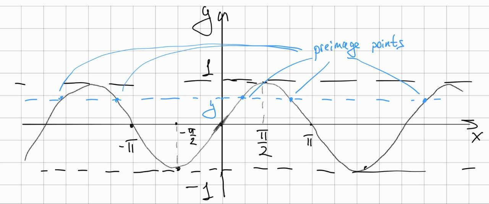

# Can a continuous on $\mathbb{R}$ function be a reverse for everywhere discontinuous function on the segment?

<!-- more -->

I found the problem in the calculus tasks for the fist-year students in my university. It goes as follows:

!!! quote
    The function $f$ is continuous on $\mathbb{R}$, and the function $g$ is defined on the interval $[0, 1]$. It is known that for every $x$ in $[0,1]$, $f(g(x)) = x$. Is $g$ necessarily continuous at least at one point?

## Reformulation

First, let's look at the task from a different angle. For $\forall y \in Imf = [0, 1]$ we have a preimage set:

$$
    S(y) = \{ x \in \mathbb{R} | f(x) = y \}.
$$

Function $g: [0, 1] \to \mathbb{R}$ for every $y$ choose some point from the preimage:

$$
    g(y) \in S(y) \  \forall y.
$$

Then, the condition from the problem holds:

$$
\begin{equation}
    f(g(y)) \equiv y.
\end{equation}
$$

Can $g$ be discontinuous everywhere for some $f$?

## Solution

Let's construct an example. First, without loss of generality we take the segment from the problem to be $[-1, 1]$. Take $f(x) = \sin x: \mathbb{R} \to [-1, 1]$. Then, take $g(y) = \sin^{-1} y = \arcsin y$ for the $y \in \mathbb{J} \cap [-1, 1]$. For the $y \in \mathbb{Q} \cap [-1, 1]$ there exists a countable number of preimage points for the $f$ (see figure below). Every preimage point belongs to the segment of type $[2 \pi n, 2 \pi n + \frac{\pi}{2}], \  n \in \mathbb{Z} \backslash \{0\}$. The set $\mathbb{Q} \cap [-1, 1]$ is countable as well. Therefore, define $g(y)$ to take the unique segment described above $\forall y \in \mathbb{Q} \cap [-1, 1]$. Note that for the irrational $y$ we have $g(y) \in [0, \frac{\pi}{2}]$.

The constructed $g$ is discontinuous at every point; $\forall y \in [-1, 1]$ we construct two Heine sequences. First is some

$$
\{ y_n^1 \}_{n=1}^{+\infty} \subset \mathbb{J} \cap [-1, 1], \ y_n^1 \to y \Rightarrow g(y_n^1) \to \arcsin y.
$$

The second is some

$$
\{ y_n^2 \}_{n=1}^{+\infty} \subset \mathbb{Q} \cap [-1, 1], \ y_n^2 \to y.
$$

Then, either $g(y_n^2)$ does not have a limit or it has one but then it cannot coincide with the $\arcsin y$ because it lies in the segment $[2 \pi n, 2 \pi n + \frac{\pi}{2}]$ for $n = 0$. Anyway, we have discontinuity in every point of $[-1, 1]$ for the $g$ by the Heine criterion of the discontinuity.

The (1) is true by the construction of the $g$ and the reasoning in the section above.
